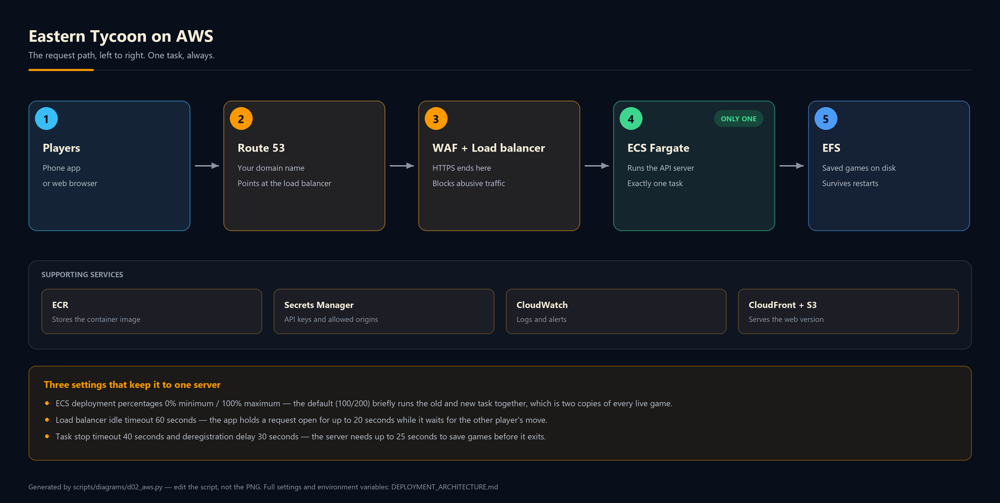
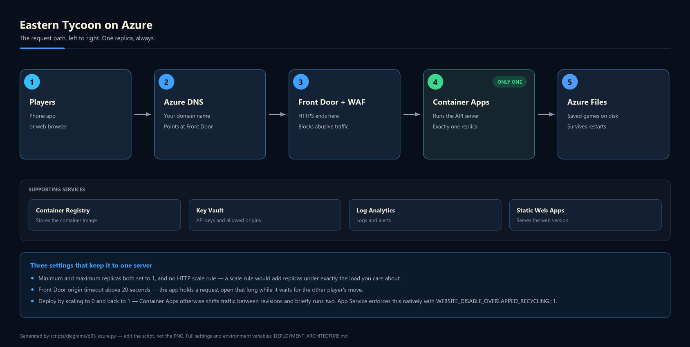

# Deployment Architecture — Eastern Tycoon

How the app is deployed, and the same design expressed on **AWS** and on **Azure**.

For a quick "just get it online" host (Railway, Render, a VPS), see
[DEPLOYING_BACKEND.md](DEPLOYING_BACKEND.md). This document is the version for a
cloud account you intend to keep.

| Diagram | What it shows |
| --- | --- |
| [01 — How it works](diagrams/01-how-it-works.png) | The whole deployment in four boxes, no service names |
| [02 — On AWS](diagrams/02-aws-architecture.png) | The request path, supporting services, the three settings that matter |
| [03 — On Azure](diagrams/03-azure-architecture.png) | The same design, box for box |
| [04 — Deploy timeline](diagrams/04-deploy-timeline.png) | What happens during a deploy, drawn to scale |

Diagrams are generated — see [Regenerating the diagrams](#regenerating-the-diagrams).

---

## 1. What actually gets deployed

Three separate artifacts, on three separate release cycles:

| Artifact | Built by | Goes to |
| --- | --- | --- |
| **API server** | `pnpm --filter @workspace/api-server build` | A container, always-on, one instance |
| **Mobile app** | EAS Build (`artifacts/dawaar`) | App Store / Play Store |
| **Web client** (optional) | `pnpm --filter @workspace/dawaar build` | Object storage behind a CDN |

The API server build is a **single self-contained file**. `esbuild` bundles
`src/index.ts` into `artifacts/api-server/dist/index.cjs` (~980 KB), and every
`require()` left in it is a Node builtin — there is no `node_modules` at
runtime. That makes the runtime image a stock `node:20-slim` with one file
copied into it.

## 2. The constraint everything else follows from

Live game state is an in-memory `Map` in `domains/services/gameStore.ts`, and
the signal that wakes a waiting client is an in-process `EventEmitter`. Neither
crosses a process boundary, so:

> **Exactly one API instance may run at a time — including during a deploy.**

A second instance holds a second copy of every board. Players routed to it poll
a `version` that never advances and watch a game that appears frozen. It
reproduces nowhere and logs nothing.

This rules out Lambda, Azure Functions, App Runner, Vercel, Cloudflare Workers,
and any autoscaling group. It also rules out the *default* rolling-deploy
settings on both ECS and Container Apps, which briefly run old and new together.

Three more properties of the code set the numbers on the timeline diagram:

| Property | Source | Consequence |
| --- | --- | --- |
| A poll parks up to **20 s** | `POLL_TIMEOUT_MS`, `src/config.ts` | Every proxy in front needs an idle timeout above 20 s |
| Shutdown drains up to **25 s** | `SHUTDOWN_TIMEOUT_MS`, `src/config.ts` | Stop timeouts and deregistration delays must exceed 25 s |
| Snapshots write to `DATA_DIR` | `resolveDataDir()`, `src/config.ts` | Needs a persistent volume, not container-local disk |

## 3. The container image

Not yet in the repo — this is the reference both clouds build from.

```dockerfile
# syntax=docker/dockerfile:1
FROM node:20-bookworm-slim AS build
WORKDIR /repo
RUN corepack enable
COPY . .
# The filter installs only the API server and the workspace packages it depends
# on, skipping the Expo client — which is the bulk of the lockfile.
RUN pnpm install --frozen-lockfile --filter @workspace/api-server...
RUN pnpm --filter @workspace/api-server run build

FROM node:20-bookworm-slim AS runtime
WORKDIR /srv
ENV NODE_ENV=production DATA_DIR=/data
COPY --from=build /repo/artifacts/api-server/dist/index.cjs ./index.cjs
RUN mkdir -p /data && chown node:node /data
USER node
CMD ["node", "index.cjs"]
```

Health check: `GET /api/healthz` → `{"status":"ok"}`.

## 4. Environment

Read once at boot in `src/config.ts`; nothing else reads `process.env`.

| Variable | Value | Notes |
| --- | --- | --- |
| `PORT` | injected by the platform | **Required** — the server throws at boot without it |
| `NODE_ENV` | `production` | |
| `DATA_DIR` | `/data` | The mounted volume |
| `CORS_ALLOWED_ORIGINS` | your web origin(s), comma-separated | Empty allows **every** browser origin; `preflight.ts` warns about this in production |
| `POLL_TIMEOUT_MS` | `20000` (default) | Raise only if you raise the shutdown deadline too |
| `SHUTDOWN_TIMEOUT_MS` | `25000` (default) | Must exceed `POLL_TIMEOUT_MS` plus snapshot time |
| `MAX_POLL_WAITERS_PER_GAME` | `24` (default) | |
| `BODY_LIMIT` | `64kb` (default) | The largest legitimate request is a trade |

Secrets come from Secrets Manager / Key Vault, never from the image.

## 5. On AWS



| Layer | Service | Configuration that matters |
| --- | --- | --- |
| DNS + TLS | Route 53 + ACM | A stable custom domain, set up **before** the first store build |
| Edge | AWS WAF on the ALB | Rate-based rule per source IP — the API has no auth of its own |
| Load balancing | Application Load Balancer | `idle_timeout` **60 s**; `deregistration_delay` **30 s** |
| Compute | ECS Fargate, 1 vCPU / 2 GB | `desiredCount` **1**; `stopTimeout` **40 s** |
| Deployment | ECS rolling update | `minimumHealthyPercent` **0**, `maximumPercent` **100** |
| State | EFS access point at `/data` | One writer, matching one task |
| Images | ECR | Immutable tag per commit |
| Secrets | Secrets Manager | Injected as task environment |
| Logs | CloudWatch (`awslogs`) | Alarm on task restarts — a restart loses live games |
| Web client | CloudFront + private S3 (OAC) | Never in front of `/api`; the API sends `no-store` |

**The setting to get right:** ECS defaults to `minimumHealthyPercent 100 /
maximumPercent 200`, which starts the new task before stopping the old one.
`0 / 100` makes it stop-then-start. That costs a few seconds of downtime per
deploy and is the correct trade here.

**Cost shape:** at one task, the ALB and a NAT gateway each cost more than the
compute. If the task needs only outbound HTTPS (RevenueCat), prefer VPC
endpoints or a public-subnet task with no NAT gateway.

## 6. On Azure



| Layer | Service | Configuration that matters |
| --- | --- | --- |
| DNS + TLS | Azure DNS + Front Door managed certs | A stable custom domain, as above |
| Edge | Front Door WAF | Rate-limit rule per client IP |
| Ingress | Container Apps ingress | Origin/request timeout above the 20 s poll park |
| Compute | Container Apps, 1 vCPU / 2 GB | `minReplicas` **1**, `maxReplicas` **1**, **no** HTTP scale rule |
| Deployment | `az containerapp` | Scale to 0, then back to 1 — see below |
| Shutdown | `terminationGracePeriodSeconds` **40** | Exceeds the 25 s drain |
| State | Azure Files share at `/data` | One writer, matching one replica |
| Images | Azure Container Registry | Pulled via managed identity |
| Secrets | Key Vault | Referenced by managed identity, not stored on the app |
| Logs | Log Analytics + App Insights | Alarm on replica restarts |
| Web client | Static Web Apps (or Blob static site) | Behind Front Door |

**The difference from AWS:** ECS can be told never to run two tasks with one
pair of percentages. Container Apps always shifts traffic from the old revision
to the new one, so single-revision mode still overlaps briefly. Two honest
options:

1. Deploy by scaling to `0` replicas, updating the image, then scaling back to
   `1` — a short, explicit outage.
2. Use **App Service** (Linux, dedicated plan, one instance) with
   `WEBSITE_DISABLE_OVERLAPPED_RECYCLING=1`, which enforces stop-then-start
   natively, and `ALWAYS_ON` enabled.

## 7. Delivery

**Backend** — GitHub Actions on push to `master`:

```
pnpm install → pnpm typecheck → pnpm test:api → docker build → push (ECR|ACR)
   → deploy (ecs update-service | az containerapp update) → poll /api/healthz
```

**Mobile** — decoupled on purpose:

```
eas.json (EXPO_PUBLIC_API_BASE_URL) → eas build --profile production → eas submit
```

`EXPO_PUBLIC_API_BASE_URL` is baked into the binary at build time, so the API
domain is effectively frozen for the life of every installed copy. Point the
first production build at a custom domain you control, never at a
platform-generated hostname — otherwise moving or rebuilding the backend means
a store release and a forced app update.

## 8. Scaling past one instance

The single-instance rule is a property of the code, not of the hosting. Lifting
it needs all three of these, together:

| Replace | With | Why all three |
| --- | --- | --- |
| The in-memory `Map` | Managed Redis | State has to be readable by any instance |
| The `gameEvents` EventEmitter | Redis pub/sub | The wake-up signal has to cross processes |
| The JSON snapshot | Postgres via `@workspace/db` | Durability stops being a file-write concern |

Doing any one or two alone still splits games. Until then, capacity is bounded
by one instance: `MAX_GAMES` is 5000 with a 2-hour idle TTL, which a 2 GB task
holds comfortably.

## 9. Deliberately not included

- **Infrastructure as code.** No Terraform or Bicep yet; this document is the
  spec they would implement.
- **The Dockerfile itself** — the reference above is not committed.
- **Authentication.** The API has none; a game code is the only identity. The
  WAF rate limit is the compensating control, and it is not a substitute.
- **Multi-region.** Meaningless while there is one stateful instance.

## Regenerating the diagrams

Sources are Python + Pillow in `scripts/diagrams/` — no Graphviz, no browser.

```bash
python scripts/diagrams/render_all.py      # or: pnpm --filter @workspace/scripts diagrams
```

| File | Output |
| --- | --- |
| `scripts/diagrams/_canvas.py` | Shared drawing toolkit (brand palette, boxes, arrows) |
| `scripts/diagrams/d01_logical.py` | `diagrams/01-how-it-works.png` |
| `scripts/diagrams/d02_aws.py` | `diagrams/02-aws-architecture.png` |
| `scripts/diagrams/d03_azure.py` | `diagrams/03-azure-architecture.png` |
| `scripts/diagrams/d04_lifecycle.py` | `diagrams/04-deploy-timeline.png` |

The PNGs are committed, so a reader never has to run this. Edit the script, run
the renderer, commit both.
